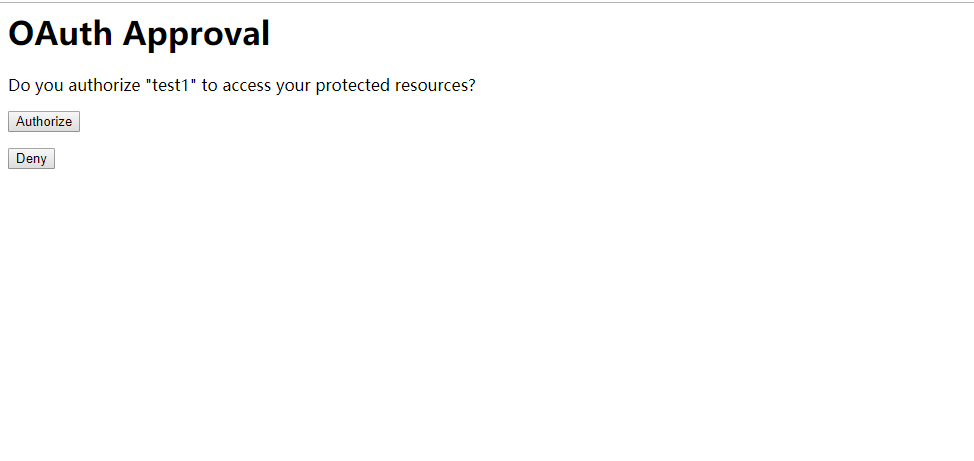
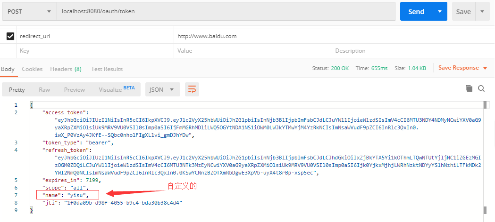
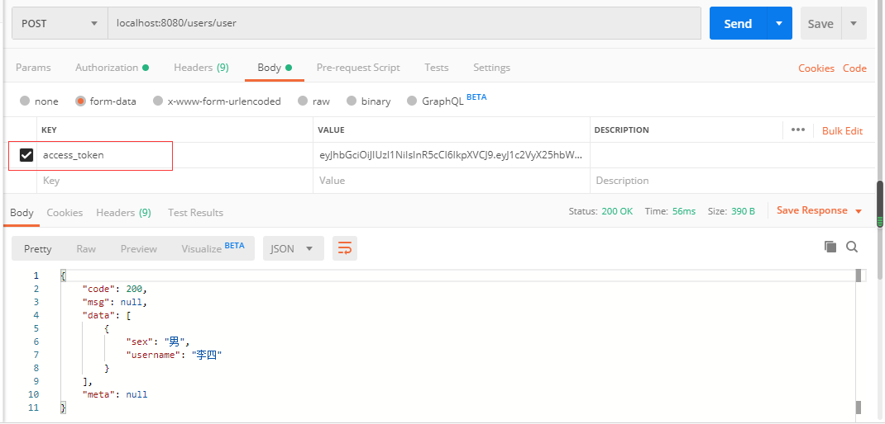

 ### 本节主要是默认的security oauth2  授权模式
 
##1.项目结构


##2.介绍
###2.1 授权介绍
#### oauth2 authorization code 大致流程
    1.用户打开客户端以后，客户端要求用户给予授权。
    2.用户同意给予客户端授权。
    3.客户端使用上一步获得的授权，向认证服务器申请令牌。
    4.认证服务器对客户端进行认证以后，确认无误，同意发放令牌。
    5.客户端使用令牌，向资源服务器申请获取资源。
    6.资源服务器确认令牌无误，同意向客户端开放资源。
#### oauth2 client credentials 大致流程
    1.客户端获取token
    2.客户端带上token 可以任意访问服务端的接口资源，和用户无关，token中没有用户信息,就是处于未登陆状态也可以访问资源接口
#### oauth2 password 大致流程
    1.客户端带上用户名和密码获取token
    2.获取的token是每个用户自己的token token中含有用户自己的信息
#### security oauth2 整合的3个核心配置类
    1.资源服务配置 ResourceServerConfiguration
    2.授权认证服务配置 AuthorizationServerConfiguration
    3.security 配置 SecurityConfiguration
#### oauth2 根据使用场景不同，分成了4种模式
    1.授权码模式（authorization code 即先登录获取code,再获取token）
    2.简化模式（implicit 在redirect_uri 的Hash传递token; Auth客户端运行在浏览器中,如JS,Flash）
    3.密码模式（ password 将用户名,密码传过去,直接获取token）
    4.客户端模式（client credentials 无用户,用户向客户端注册,然后客户端以自己的名义向’服务端’获取资源）


### 2.2请求方式
    1. /oauth/authorize：授权端点。
    2. /oauth/token：获取token。
    3. /oauth/confirm_access：用户确认授权提交端点。
    4. /oauth/error：授权服务错误信息端点。
    5. /oauth/check_token：用于资源服务访问的令牌解析端点。
    6. /oauth/token_key：提供公有密匙的端点，如果你使用JWT令牌的话。
    7. /oauth/logout: 退出

## 3.请求模式测试
### 3.1 授权码模式
浏览器直接访问地址:`http://localhost:8080/oauth/authorize?response_type=code&client_id=test1&redirect_uri=http://www.baidu.com&scope=all`

点击Authorize就会跳转到redirect_uri对应的页面
```text
       client_id：第三方应用在授权服务器注册的 Id
       response_type：固定值　code。
       redirect_uri：授权服务器授权重定向哪儿的 URL。
       scope：权限
       state：随机字符串，可以省略
```
授权之后会得到一个code https://www.baidu.com/?code=7lIyIa
以下利用postman发送接口
#### 3.1.1 构建请求AUthorization

#### 3.1.2 请求参数

#### 3.1.3 响应结果

#### 3.1.4 根据token请求users/user接口

#### 3.1.5 用错误的token请求users/user接口

### 3.2 密码模式
#### 3.2.1 构建请求AUthorization

#### 3.2.2 请求及响应结果参数

#### 3.2.3 设置存储类型为redis
```yml
fw:
  security:
    oauth2:
      storeType: redis
```

#### 3.2.4 刷新access_token
